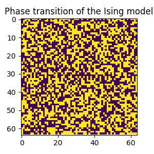

This repository contains code to either perform simple MD simulations in a 
2d-box or perform a 2d-Ising model simulation and visualisation.
The MD simulation code is explained below in a little more detail. 
For both cases, there is an example jupyter notebook in this repository.
Note, that there are packages like ASE which make MD simulations much easier, 
but this project contains code for performing 2d MD simulations from scratch.

The MD simulations may look like this:

And a phase transition of a 2D Ising model like this:

## Explanation of the classes and methods

### The `box_simulation` class
This class contains several methods allowing to perform both MD and MC simulations in two dimensions. The corresponding methods are described below:
* `generate_particles()`
	+ `test_particles=[]` allows to perform tests with particles `p=[x,y,vx,vy]`
	+ `v=1` the initial velocity of all particles
	+ `m=1` the particles mass
	+ `T=0` temperature, if provided, the velocities are assigned according to the corresponding Maxwell Boltzmann distribution
	+ `grid=False` if this is set to true, the particles are arranged in a grid in the box
* `save_particle_positions()`
	+ `step` is the step of which the positions should be saved
	+ `filename` is the filename of the output file
* `load_particles()`
	+ `filename` input file containing the positions
	+ `new_velocities`
	+ `v`
	+ `T`
* `MD_simulation()`
	+ `step_interval=1` in nano-seconds
	+ `use_lower_cutoff=False` lower cutoff of LJ potential
	+ `upper_cutoff=False` upper cutoff of LJ potential
	+ `T=100` temperature of the berendsen thermostat (if T=0, then no thermostat will be used)
* `MC_simulation()`
	+ `r_length=0.01` length of one displacement
	+ `T=50` temperature
	+ `maximal_steps=100000`
* `run_SD()`
	+ `step_length=0.01`
	+ `plot_from=False` first step included in the energy plot
* `plot_energies()`
	+ `only_Epot=False`
* `plot_temperatures()`
* `plot_trajectories()`
	+ `ms_between_frames=30` time in milliseconds between two frames
	+ `dot_size=3` size of the dots in the animation video
	+ `steps_per_frame=5` number of steps per frame (i.e. 5 means every fifth entry is plotted)
* `occupation()`
	+ `start=0` first step included in the histogram
	+ `end=0` last step included in histogram, if 0 all steps are included
	+ `n_bins=50` number of bins per axis
* `velocity_distributions()`
	+ `start=0`
	+ `end="standard"`
	+ `n_bins=50`
	+ `width=100` width of the plot (needs to be adjusted to see the whole distributions)
* `RDF()`
	+ `n_bins=50` number of bins in the distance histogram and number of points in the RDF plot
	+ `dr=0.01` dr used for the calculation (width of the circle)

## Example for how to run a box simulation

Initialise the box, minimise the potential energy with steepest descent, save particle positions

	n_steps = 500
	box = box_simulation(5, 5, n_particles=9**2, n_steps=n_steps, particle_mass=0.018)
	box.generate_particles(T=50)
	n_min = box.run_SD(step_length=0.01, plot_from=False)
	box.save_particle_positions(n_min, filename="testSD.txt")

Load the minimised particle positions and run the simulation

	box.load_particles(filename="testSD.txt", v=10000, T=0)
	box.MD_simulation(step_interval=2e-6, upper_cutoff=0.9, T=100)
	box.plot_energies()
	box.animate_trajectories(ms_between_frames=20, steps_per_frame=20)

